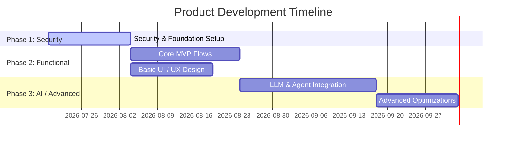

# Docusaurus Product Roadmap Template

Below is the standard Docusaurus-compatible roadmap template. Copy this format when generating `roadmap.md` for a project.

```markdown
---
id: roadmap
title: Product Roadmap
sidebar_label: Roadmap
sidebar_position: 1
---

# Product Roadmap: [Product Name]

This document outlines the phased roadmap for [Product Name]. Development is structured around a **Security-First Tiering System** to ensure the core is secure, functional, and ready for advanced integrations.

---

## Roadmap Overview



---

## Phase 1: Security & Foundation (Highest Priority)
*Goal: Build a secure, robust foundation before introducing UI or business logic.*

### Key Security Deliverables
- **[ ] Sec-1.1: Authentication & RBAC**
  - Implement secure JWT-based session management, cookies with `HttpOnly`, `Secure`, and `SameSite` flags.
  - Setup Role-Based Access Control (Admin, Member, Guest).
- **[ ] Sec-1.2: Data Protection & Secrets Management**
  - Integrate a secure key manager (e.g. AWS Secrets Manager, GCP Secret Manager, or encrypted environment files).
  - Setup SSL/TLS enforcement and database encryption at rest.
- **[ ] Sec-1.3: Input Sanitization & Threat Protection**
  - Implement request validation schemas (e.g. Zod, Joi).
  - Setup rate-limiting middleware to guard against DDoS and brute force.
  - Configure CORS rules to prevent unauthorized domain API access.
- **[ ] Sec-1.4: Security Auditing**
  - Setup centralized audit logs for auth events (logins, failures, permissions changes).

---

## Phase 2: Functional Core & Basic UI (Functional MVP)
*Goal: Implement the primary business flow and user journey with a clean, responsive layout.*

### Key Functional Deliverables
- **[ ] Fun-2.1: Primary Flow (Happy Path)**
  - [Describe the core transaction, task, or user activity].
- **[ ] Fun-2.2: Responsive User Interface**
  - Implement basic navigation, settings page, and dashboard.
  - Use clean Vanilla CSS, standard UI layouts, and ensure semantic HTML (a11y guidelines).
- **[ ] Fun-2.3: Core API Services**
  - Basic CRUD endpoints for resource management.

---

## Phase 3: AI & Advanced Enhancements (Value Addition)
*Goal: Integrate AI capabilities, agentic loops, and advanced animations/micro-interactions.*

### Key AI & Advanced Deliverables
- **[ ] Adv-3.1: AI Orchestration**
  - Integrate Gemini / Vertex AI client libraries.
  - Setup structured output parsing (JSON Mode) and prompt safety guardrails.
  - Implement offline/background agentic loops or processing.
- **[ ] Adv-3.2: Advanced UX & Polish**
  - Add micro-animations, theme toggling, and view transitions.
  - Optimize Core Web Vitals (LCP, INP) and image loading.
```
