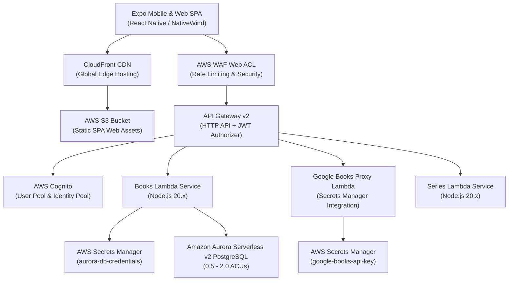
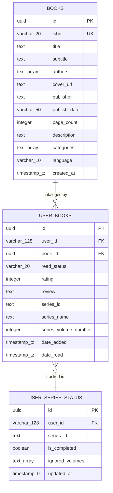

# AWS Infrastructure & Database Architecture ☁️🐘

This document outlines the cloud infrastructure, serverless services, database schema, and deployment pipelines powering the **Librarian** application.

---

## 🏛️ System Architecture Overview



---

## 🗄️ Database Schema & Flyway Migrations

The application uses **Amazon Aurora Serverless v2 PostgreSQL** with a normalized relational database design to eliminate book data duplication across users.

### Schema Structure (`backend/migrations/V1__initial_schema.sql`)



### Internal ISBN Lookup & Deduplication Flow
1. When a user scans or adds a book by ISBN, `addBookForUser` executes `SELECT id FROM books WHERE isbn = $1`.
2. **Hit**: Reuses the existing `books.id` without making an external API request.
3. **Miss**: Queries Google Books API via the backend proxy, inserts a single shared row into `books`, and creates the user junction record in `user_books`.

---

## 🔄 CI/CD Database Deployment Pipeline

Database migrations are managed using **Flyway CLI** embedded directly into the backend deployment workflow ([`.github/workflows/deploy-backend.yml`](file:///Users/richarddowsett/development/librarian/.github/workflows/deploy-backend.yml)):

```yaml
- name: Run Flyway PostgreSQL Database Migrations
  if: github.ref == 'refs/heads/main' && github.event_name == 'push'
  uses: flyway/flyway-action@v10
  with:
    url: 'jdbc:postgresql://${{ secrets.DB_HOST }}:${{ secrets.DB_PORT || '5432' }}/${{ secrets.DB_NAME || 'librarian' }}'
    user: '${{ secrets.DB_USER }}'
    password: '${{ secrets.DB_PASSWORD }}'
    locations: 'filesystem:backend/migrations'
    command: 'migrate'
```

---

## 🔒 Security & Fine-Grained Access Control

- **Cognito JWT Validation**: API Gateway validates JWT tokens issued by AWS Cognito User Pool before routing requests to backend Lambdas.
- **Backend API Key Shielding**: Google Books API calls execute strictly on backend Lambdas using credentials retrieved from AWS Secrets Manager (`google-books-api-key`). The API key is never exposed to the client.
- **PostgreSQL Scoping**: User library queries filter by `user_id` (Cognito `sub`), ensuring complete data isolation between users.
- **AWS WAF Protection**: Regional Web ACL enforces IP rate-limiting (default 2000 requests per 5 minutes per IP) and protects against common web vulnerabilities.
