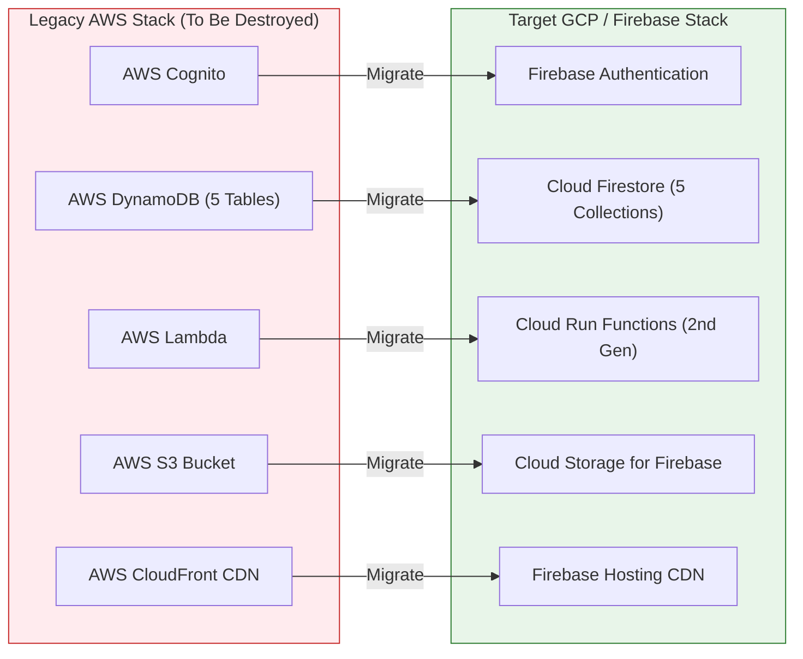

# 🚀 Migration Plan: AWS to Google Cloud Platform (GCP) & AWS Resource Teardown

> **Objective**: Migrate **Shelfd** from AWS (DynamoDB, Cognito, Lambda, S3, CloudFront) to Google Cloud Platform & Firebase (Cloud Firestore, Firebase Auth, Cloud Run Functions 2nd Gen, Cloud Storage, Firebase Hosting), including complete teardown and deletion of all AWS resources.

---

## 🎯 Executive Summary & Scope

* **Data Migration**: Out of scope (Clean state migration; users will re-enter their books manually as requested).
* **AWS Teardown**: Complete removal of all billable AWS infrastructure via automated Terraform destruction & S3 purging.
* **Target Architecture**: GCP & Firebase Stack (Serverless NoSQL, Firebase Authentication, Cloud Run Functions, Cloud Storage, Firebase Hosting).
* **Infrastructure as Code**: Refactored `terraform/` using the `hashicorp/google` provider.

---

## 🏗️ Architectural Mapping (AWS → GCP / Firebase)



| Component | AWS Resource | GCP / Firebase Target Resource | Function in Shelfd |
| :--- | :--- | :--- | :--- |
| **Authentication** | AWS Cognito User Pools | **Firebase Authentication** | Email/Password & Google OAuth identity management |
| **Database** | AWS DynamoDB (5 tables) | **Cloud Firestore** (5 collections) | Serverless document database (`users`, `books`, `userLibrary`, `series`, `userSeriesStatus`) |
| **Compute / API** | AWS Lambda Handlers | **Cloud Run Functions (2nd gen)** | HTTP API endpoints for Books, Series, and Bookshelf AI |
| **Asset Storage** | AWS S3 Bucket | **Cloud Storage for Firebase** | Image storage for bookshelf photo AI scans |
| **Secrets** | AWS Secrets Manager | **Google Cloud Secret Manager** | Secure storage of Gemini 2.5 Flash API keys |
| **Web Hosting** | AWS S3 + CloudFront CDN | **Firebase Hosting** | Fast global CDN deployment for Expo Web SPA |
| **IaC** | Terraform (AWS Provider) | **Terraform (Google Provider)** | Declarative GCP infrastructure provisioning |

---

## 💣 Phase 1: AWS Resource Teardown & Deletion Plan

To ensure no lingering billable resources remain on AWS while preserving the AWS account itself:

### Step 1.1: Purge All AWS S3 Buckets
S3 buckets with content block Terraform destruction. Empty all buckets first:
```bash
aws s3 rm s3://shelfd-bookshelf-uploads --recursive
aws s3 rm s3://shelfd-frontend-bucket --recursive
```

### Step 1.2: Execute Terraform Destroy
Run automated destruction for all AWS infrastructure managed by Terraform:
```bash
cd terraform
terraform destroy -auto-approve
```
*Destroys: CloudFront Distributions, Cognito User Pools, DynamoDB Tables, WAF Web ACLs, S3 Buckets, IAM Roles, and CloudWatch Log Groups.*

### Step 1.3: Verification of AWS Zero-Resource State
Verify all resources have been removed:
```bash
aws dynamodb list-tables
aws cognito-idp list-user-pools --max-results 10
aws cloudfront list-distributions
```

---

## 🛠️ Phase 2: GCP & Firebase Infrastructure Setup (Terraform)

Provision the GCP environment using Terraform:

### 2.1 Terraform GCP Configuration (`terraform-gcp/main.tf`)
```hcl
terraform {
  required_version = ">= 1.5.0"
  required_providers {
    google = {
      source  = "hashicorp/google"
      version = "~> 5.0"
    }
  }
}

provider "google" {
  project = var.gcp_project_id
  region  = var.gcp_region
}
```

### 2.2 GCP Resources to Provision
- **`google_firestore_database`**: Native Mode Firestore database.
- **`google_firebase_project`**: Enables Firebase services on the GCP project.
- **`google_storage_bucket.bookshelf_uploads`**: Bucket for bookshelf scan images.
- **`google_secret_manager_secret.gemini_api_key`**: Secret for Gemini API key.
- **`google_cloudfunctions2_function.backend_api`**: 2nd gen Cloud Function / Cloud Run service.

---

## 💻 Phase 3: Backend Refactoring (`backend/`)

1. **Package Dependency Update**:
   - Uninstall: `@aws-sdk/client-dynamodb`, `@aws-sdk/lib-dynamodb`, `@aws-sdk/client-s3`, `@aws-sdk/client-secrets-manager`, `@aws-sdk/s3-request-presigner`.
   - Install: `firebase-admin`, `@google-cloud/storage`, `@google-cloud/secret-manager`.

2. **Database Service Migration (`backend/src/services/firestoreService.ts`)**:
   - Replace DynamoDB `PutCommand`, `QueryCommand`, `GetCommand` with `firebase-admin/firestore` document collection calls (`db.collection('books').doc(id)`).

3. **Storage Service Migration (`backend/src/handlers/bookshelfAiHandler.ts`)**:
   - Replace S3 presigned upload URLs with GCP Cloud Storage v4 signed upload URLs (`bucket.file(s3Key).getSignedUrl(...)`).

4. **Secrets Migration (`backend/src/services/geminiService.ts`)**:
   - Update Secret Manager fetcher to use `@google-cloud/secret-manager` (`SecretManagerServiceClient`).

---

## 📱 Phase 4: Frontend App Refactoring (`app/`)

1. **Authentication Migration (`app/src/services/firebaseAuthService.ts`)**:
   - Replace Cognito SDK with `firebase/auth` (`signInWithEmailAndPassword`, `createUserWithEmailAndPassword`, `signOut`, `onAuthStateChanged`).

2. **API Client Integration (`app/src/services/apiClient.ts`)**:
   - Attach Firebase ID Tokens to outgoing requests (`Authorization: Bearer ${await auth.currentUser?.getIdToken()}`).

3. **Firebase Configuration**:
   - Add `EXPO_PUBLIC_FIREBASE_API_KEY`, `EXPO_PUBLIC_FIREBASE_PROJECT_ID`, `EXPO_PUBLIC_FIREBASE_AUTH_DOMAIN` to `app/.env`.

---

## 🔄 Phase 5: CI/CD & Deployment Pipeline Update

1. **GitHub Actions (`.github/workflows/deploy-app.yml`)**:
   - Replace AWS Credentials Action (`aws-actions/configure-aws-credentials`) with GCP Auth Action (`google-github-actions/auth@v2`).
   - Deploy Expo Web SPA to Firebase Hosting using `Firebase CLI`:
     ```yaml
     - name: Deploy to Firebase Hosting
       uses: FirebaseExtended/action-hosting-deploy@v0
       with:
         repoToken: "${{ secrets.GITHUB_TOKEN }}"
         firebaseServiceAccount: "${{ secrets.GCP_SA_KEY }}"
         channelId: live
         projectId: "${{ secrets.GCP_PROJECT_ID }}"
     ```

---

## 🚦 Execution Checklist & Matrix

- [ ] **Step 1**: Execute AWS S3 purge & `terraform destroy`.
- [ ] **Step 2**: Initialize GCP Terraform & provision Firestore, Storage, Secret Manager.
- [ ] **Step 3**: Refactor `backend/` to `firebase-admin` & Cloud Storage.
- [ ] **Step 4**: Refactor `app/` to `firebase/auth`.
- [ ] **Step 5**: Test full end-to-end user signup, book adding, series tracking, and bookshelf AI scanning on GCP.
- [ ] **Step 6**: Update CI/CD GitHub Actions pipeline to deploy to Firebase Hosting & Cloud Run.
