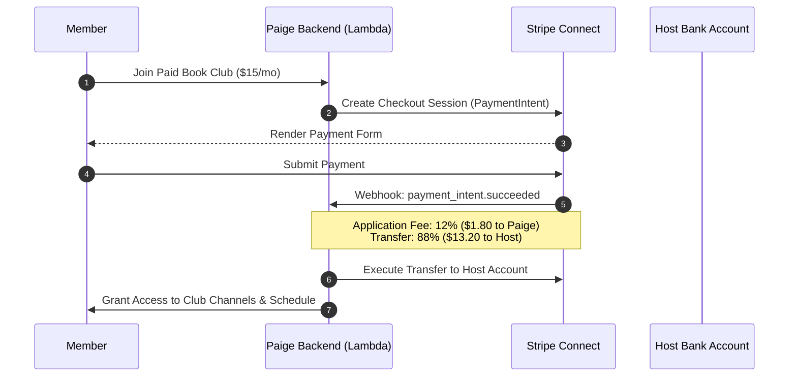

# MVP Spec: Paige Book Clubs & Community Engine 📖👥

## 🎯 Objectives
* Enable readers to create, discover, and join public or private book clubs.
* Streamline member invitations via dynamic share links and scannable QR codes.
* Provide democratic book selection (voting) and automated weekly reading schedule generation.
* Facilitate chapter-gated spoiler-free discussion channels and live meeting scheduling.
* Establish a solid monetization foundation supporting both SaaS host subscriptions and paid ticketed reading groups via Stripe Connect.

---

## 👤 Target Audience
* **Club Hosts & Community Leaders**: Bookstagrammers, BookTok creators, indie bookstore managers, local neighborhood organizers.
* **Club Members**: Readers seeking accountability, structured schedules, and engaging discussions without plot spoilers.

---

## 🚫 Out of Scope for MVP
* Native video call streaming inside the app (relying on deep links to Zoom, Google Meet, or Discord).
* Physical print-on-demand fulfillment (relying on external affiliate purchase links).

---

## 🏗️ Core MVP Modules

### 1. Selection & Schedule Planner
* **Candidate Pool**: Hosts add 2–5 books from Paige's global catalog into a voting poll.
* **Poll Engine**: Members vote before a set deadline. The winning title automatically generates a weekly chapter breakdown.
* **Pacing Calculator**: Divides total chapters/pages evenly across the club's target timeframe (e.g., 4 weeks).

### 2. Member Onboarding & Invites
* **Tokenized Invite Link**: Generates a shareable URL (`https://paige.app/join/club-uuid?token=...`).
* **In-Person QR Code**: Mobile app renders a high-res QR code for scanning at local coffee shops or library meetups.
* **Role Permissions**: Hosts can promote members to Co-Hosts or remove abusive participants.

### 3. Chapter-Gated Chat & Meetings
* **Schedule-Locked Threads**: Chat channels locked by chapter range (e.g., "Week 2: Ch 6-10"). Prevents members reading ahead from spoiling slower readers.
* **Event Scheduler**: Create upcoming live meeting events with `.ics` calendar sync and external video URL attachment.

---

## 💰 Monetization Architecture

1. **Stripe Connect Integration**: Hosts onboard via Stripe Express. When a paid club is created, Paige handles billing and automatically deducts a **12% platform fee**.
2. **Paige Host Pro Subscriptions**: Track host entitlements via RevenueCat or direct Stripe Billing subscriptions.
3. **Affiliate Buy Buttons**: Automatically append affiliate tags to candidate and selected books on Amazon & Bookshop.org.

---

## 🔒 Security & Performance Architecture

* **Database & Access Control**: Amazon Aurora Serverless v2 PostgreSQL tables scoped by `club_id` and `user_id` ensure non-members cannot read club chat or vote data.
* **API Gateway JWT Authorizer**: Every request is validated against AWS Cognito User Pool claims.
* **Signed Invite Tokens**: HMAC-SHA256 signed invite payloads prevent link forgery and unauthorized club joins.
