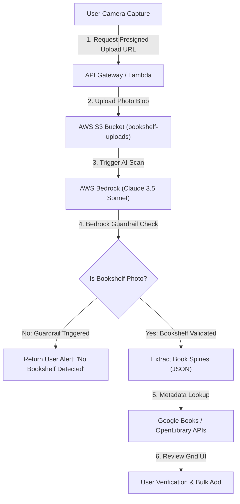

# MVP Specification: Bookshelf AI Scanner

## 1. Executive Summary & Objective

Scanning barcodes one by one for hundreds of physical books is time-consuming and inefficient. The **Bookshelf AI Scanner** allows users to take a photo of an entire bookshelf. Using **Amazon Bedrock (Anthropic Claude 3.5 Sonnet Vision)**, the system extracts visible book titles and authors from spines in a single pass. 

To prevent invalid requests and save AI costs, the system uses a **Two-Tier AI Guardrail** that rejects non-bookshelf photos. Once book titles are recognized, the backend resolves full metadata (ISBN, high-res covers, page counts, publishers) via Google Books and OpenLibrary APIs. Finally, users review the detected books in an interactive verification grid before batch-cataloging them to their personal library.

---

## 2. Security-First Architecture & Guardrails (Phase 1)

### Security & Guardrail Controls:
1. **Presigned S3 Upload URLs**: Presigned URLs enforce file type (`image/jpeg`, `image/png`, `image/webp`) and expiration limits (15 minutes). Images in `bookshelf-uploads` automatically expire after 24 hours via S3 lifecycle rules.
2. **Infrastructure-Level Guardrails**: Configured via Terraform `aws_bedrock_guardrail` to restrict non-relevant or sensitive topics.
3. **Prompt Classifier Guardrail**: Claude 3.5 Sonnet system prompt forces a boolean classification check (`is_bookshelf: boolean`). If `is_bookshelf` is false, extraction halts immediately and returns a friendly error message to the client.

---

## 3. Core Functional Requirements (Phase 2 & Phase 3)

### Backend Requirements:
- `POST /bookshelf/presigned-url`: Generates S3 upload credentials.
- `POST /bookshelf/analyze`: Accepts S3 key, calls Bedrock Claude 3.5 Sonnet multimodal model, extracts titles/authors, resolves metadata against Google Books & OpenLibrary, and returns candidate books.

### Frontend & Review UX Requirements:
- **Photo Capture & Upload Component**: Camera stream or image gallery selection with presigned S3 upload.
- **Guardrail Alert**: Instant notification if photo is rejected as non-bookshelf.
- **Interactive Review Step Grid**:
  - Displays cover art, title, author, ISBN, and page count for each identified book.
  - Allows inline editing of titles/authors for misread spines.
  - Allows manual search fallback for missed items.
  - Provides "Select All" / "Deselect All" checkboxes and "Add Selected to Library" bulk action.

---

## 4. User Story & Acceptance Criteria

**As a** book collector with large physical bookshelves,  
**I want to** take a photo of my bookshelf and review AI-identified books,  
**So that** I can rapidly catalog hundreds of books into my library without manually scanning individual barcodes.

### Acceptance Criteria:
- **Given** a user takes a photo of a valid bookshelf,  
  **When** the photo is submitted to Bedrock,  
  **Then** all readable book spines are recognized and resolved to rich metadata for user review.
- **Given** a user uploads a non-bookshelf photo (e.g. a pet or room landscape),  
  **When** the AI guardrail executes,  
  **Then** the scan halts gracefully and displays an informative alert to try again with a bookshelf photo.
- **Given** candidate books are presented in the Review Grid,  
  **When** the user modifies a title or unchecks specific books and clicks "Add Selected to Library",  
  **Then** only verified selected books are added to the user's staged queue / catalog.
