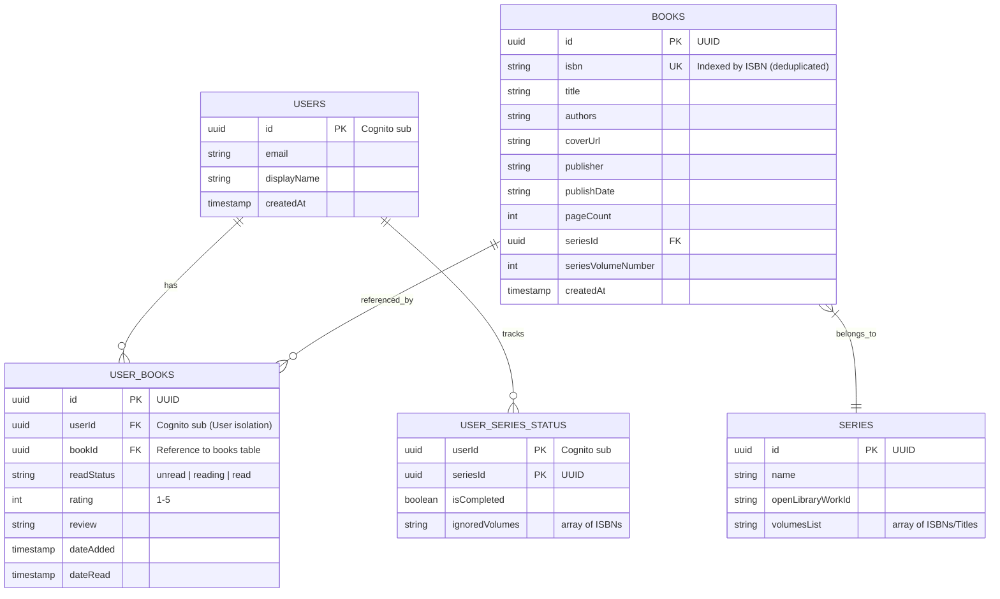

# Librarian MVP Specification

This document details the scope, goals, and architecture for the initial Minimum Viable Product (MVP) of **Librarian**, the book cataloguing application.

---

## 1. Objective
Librarian's MVP solves the core pain point of physical book collectors: losing track of what they own, what they have read, and what volumes are missing from their favorite series. 

By providing a fast, cross-platform barcode-scanning experience coupled with automated series tracking and secure cloud sync, Librarian ensures that users can confidently catalog their collections and never buy duplicate copies or miss a series volume.

---

## 2. Target Audience
*   **Heavy Readers**: People who read dozens of books a year and need to keep track of their status and thoughts.
*   **Book Collectors**: Individuals with large home libraries who need a quick way to audit their collection (by barcode scanning) while walking through bookstores.
*   **Series Enthusiasts**: Collectors who read series of books (e.g., fantasy, sci-fi, manga, comics) and want to visually track their completion progress.

---

## 3. In Scope vs. Out of Scope

### In Scope for MVP
*   **Single Codebase Setup**: React Native / Expo project configured for Web, iOS, and Android.
*   **Security Foundation**:
    - AWS Cognito User Pools & Identity Pools with passwordless/OTP links and federated Google/Apple sign-in.
    - Database user isolation in Amazon Aurora Serverless v2 PostgreSQL (0.5 - 2.0 ACUs) managed with Flyway migrations (`backend/migrations/V1__initial_schema.sql`) in GitHub Actions (`deploy-backend.yml`).
    - AWS WAF with rate limiting and bot protection.
    - Zod schemas for sanitizing and validating all user input.
*   **Cataloging Engine**:
    - Device/webcam barcode scanning to read ISBN.
    - Integration with the Open Library API to resolve ISBNs to book meta-information.
    - Manual fallback creation form for books without barcodes or missing from Open Library.
*   **Catalog Management**:
    - Catalog listing with text search, read status sorting (Unread, In Progress, Read), and star rating reviews.
*   **Series Tracker**:
    - Integration with Open Library's series indexes to automatically group owned books and show missing volumes.

### Out of Scope for MVP (Future Phases)
*   **Social & Sharing**: Book clubs, lending tracking, or sharing library catalogs with friends.
*   **OCR Title Scanning**: Scanning book spines or covers using AI to log books without barcodes.
*   **AI Recommendations**: Gemini / Amazon Bedrock recommendation engines (deferred to Milestone 3).
*   **Multiple Libraries**: Creating separate sub-catalogs (e.g., "Home Library", "Office Library", "E-Books").
*   **Custom Series**: Manually creating complex custom series graphs that don't exist in public metadata.

---

## 4. Security Architecture & Threat Modeling

Since Librarian stores personal user logs and uses federated authentication, security is prioritized from the start.

### Threat Modeling & Controls

| Threat Vector | Description | MVP Control / Mitigation |
| :--- | :--- | :--- |
| **Unauthorized Data Access** | Users accessing or editing other users' libraries. | **PostgreSQL User Isolation** isolating `user_books` records by `user_id` matching the Cognito `sub` claim. |
| **Injection Attacks** | Malicious book title or review inputs causing XSS or script execution. | **Zod validation schemas** run on the client before writing, and all text elements rendered using standard React Native/React text components which escape HTML by default. |
| **API Abuse / Spam** | Malicious scripts making excessive calls to API wrappers or backend resources. | **AWS WAF (Web Application Firewall)** with IP rate-limiting, AWS Managed Rules, and Cognito JWT authorization on API endpoints. |
| **Secrets Exposure** | Hardcoded AWS config keys or credentials exposed in version control. | **Expo Environment Variables** (`.env` files) git-ignored, and production credentials stored in AWS Parameter Store / Secrets Manager. |
| **Authentication Spoofing** | Forging authentication state or hijacking sessions. | **AWS Cognito OAuth 2.0 / OIDC Tokens** managed securely by Cognito SDK, using secure device keychain/keystore for token storage. |

---

## 5. Amazon Aurora Serverless v2 PostgreSQL Schema

Database Architecture: **Amazon Aurora Serverless v2 PostgreSQL (0.5 - 2.0 ACUs)**.  
Database Migrations: Managed using **Flyway SQL migrations** (`backend/migrations/V1__initial_schema.sql`) integrated in GitHub Actions (`deploy-backend.yml`).

