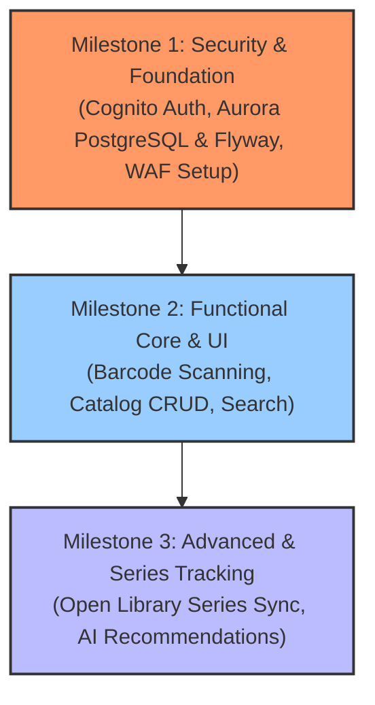

# Librarian Product Roadmap

# Librarian Product Roadmap

Librarian is a personal book cataloguing application designed to help book lovers keep track of their personal library, record reading progress and reviews, and monitor book series progress (including missing volumes to purchase). 

This roadmap outlines the three development milestones based on a security-first framework, using **React Native / Expo** to target Web, iOS, and Android from a single codebase, and leveraging **AWS Cognito & Amazon Aurora Serverless v2 PostgreSQL** (with Flyway schema management) for security, user data isolation, and cloud syncing.

---

## Milestone 1: Security & Foundation (High Priority)
Before implementing any functional business logic, a secure foundation must be established. This phase focuses on setting up the workspace, configuring identity and access management, deploying WAF protections, and securing data storage via PostgreSQL user data isolation.

### Goals
1. **Workspace Initialization**: Setup Expo Project with Tailwind CSS support (if requested) or native styling solutions (React Native StyleSheets).
2. **Federated & Passwordless Authentication**:
   - **AWS Cognito User Pools & Identity Pools** integration.
   - Passwordless magic link / OTP login via Cognito Custom Auth triggers (AWS Lambda).
   - Federated identity providers: Google Sign-In and Sign in with Apple mapped via Cognito IdP.
3. **Database Security & Relational Schema Management**:
   - Provision **Amazon Aurora Serverless v2 PostgreSQL** (0.5 - 2.0 ACUs) with Flyway SQL migrations (`backend/migrations/V1__initial_schema.sql`) integrated in GitHub Actions (`deploy-backend.yml`).
   - Implement deduplicated catalog schema with a global shared `books` table indexed by ISBN and a `user_books` junction table enforcing absolute user data isolation by `user_id` (Cognito `sub`). Users can only access, rate, or update their own library records.
4. **App Security & Edge Protection**:
   - Deploy **AWS WAF** (Web Application Firewall) on API Gateway / AppSync with rate limiting and Managed Rule Sets (replacing Firebase App Check).
5. **Data Input Validation**:
   - Establish zod schemas for validating book entries, ratings, reviews, and profile data at the boundary.

---

## Milestone 2: Functional Core & Basic UI
Once the platform is secured, we will build out the core workflow: scan barcode, retrieve book details, catalog it, and manage the collection.

### Goals
1. **Adaptive Navigation & Shell**:
   - Responsive sidebar layout for Web.
   - Bottom tab bar layout for iOS/Android using Expo Router.
2. **Barcode Scanner (Camera & Fallback)**:
   - Use `expo-camera` / standard scanning libraries to scan ISBN barcodes via device camera (mobile) or webcam (web).
   - Provide manual numeric ISBN input fallback form.
3. **Metadata Lookup**:
   - Query the **Open Library API** using the scanned ISBN.
   - Fall back gracefully to user-friendly forms to populate missing metadata (Title, Author, Cover Image, Publisher, Publish Date, Page Count).
4. **Personal Library Dashboard & Search**:
   - Interactive library catalog listing.
   - Fast, local-first client filtering and text search over owned catalog.
   - Filter collections by: Read status (Unread, In Progress, Read) and Custom categories/tags.
5. **Rating & Reviews**:
   - Quick rating (1-5 stars).
   - Review text box and date read logging.

---

## Milestone 3: Advanced Features & Series Tracking
With the core catalog working, we will implement the series tracking features and smart recommendations.

### Goals
1. **Open Library Series Auto-Discovery**:
   - Query the Open Library API (or alternative book databases if needed) to determine if a cataloged book belongs to a series.
   - Retrieve full list of volumes within that series.
2. **Series Tracking & Wishlists**:
   - Visualize series progress: which volumes are currently owned, read, or missing.
   - Generate an automated "Buy List" or wishlist for missing volumes.
3. **AI Book Recommendations**:
   - Leverage Amazon Bedrock / Gemini API to analyze the user's current library, star ratings, and review content.
   - Generate personalized recommendations for next reads or new series to start.
4. **Offline Sync & Caching**:
   - Configure local caching / AWS AppSync offline persistence so cataloging can occur offline (e.g., in a basement bookstore) and sync seamlessly when reconnecting.
