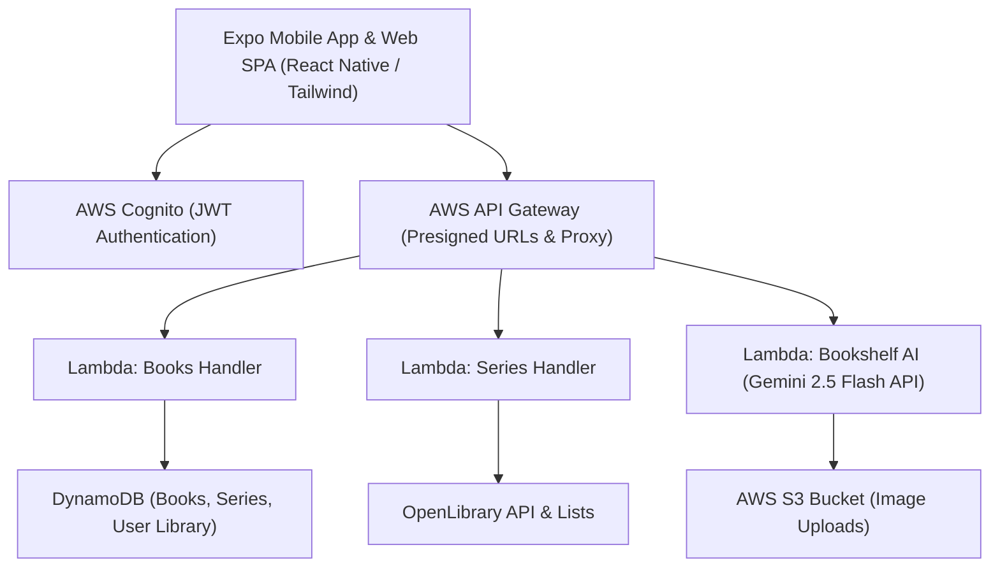

# 📚 Shelfd — Project Brief & Vision

> **Shelfd** is an intelligent personal library management, bookshelf photo AI scanner, and series completion tracking platform.

---

## 🎯 Executive Summary

**Shelfd** empowers readers and book collectors to catalog their home libraries in seconds, track series completion status, avoid duplicate bookstore purchases, and discover missing books in their collections. By combining computer vision & generative AI (Gemini 2.5 Flash), barcode scanning, and OpenLibrary integration, Shelfd bridges the physical bookshelf experience with smart digital tracking.

---

## 💡 Key Value Propositions

1. **Instant Bookshelf Photo AI Scanning**: Take a single photo of a physical bookshelf or stack of books. Shelfd's AI extracts book titles and authors, searches library catalogs, and stages them for 1-tap addition.
2. **"Do I Own This?" Bookstore Lookup**: Fast in-store barcode scanner and search tool that instantly alerts readers if a book is already in their physical or digital collection.
3. **Smart Series Completion Tracker**: Track multi-volume book series and custom OpenLibrary lists with automatic staleness diffing and 1-week auto-refreshes.
4. **Author Collections**: Automatically aggregate all collected and published books by your favorite authors (e.g., Stephen King, Brandon Sanderson, Lee Child).
5. **Cross-Platform & Offline Ready**: Seamless experience on iOS, Android, and Web SPA backed by AWS serverless infrastructure.

---

## 👤 Target User Personas

### 1. The Series Completionist
* **Needs**: Tracks multi-volume book series (fantasy, sci-fi, manga, fiction). Needs to know which volumes are owned, which are unowned, and where gaps exist in sequence.
* **Shelfd Solution**: Interactive Series Tracker with OpenLibrary list importing, unowned book preview blurbs, and 1-tap library additions.

### 2. The Avid Collector & Bookstore Browser
* **Needs**: Regularly browses physical bookstores and libraries. Needs instant answers to "Do I already own this edition?" to prevent accidental duplicate purchases.
* **Shelfd Solution**: Lightning-fast barcode scanner and instant search overlay with visual ownership badges.

### 3. The Home Library Organizer
* **Needs**: Has hundreds of physical books at home and doesn't want to type ISBNs manually.
* **Shelfd Solution**: Bookshelf Photo AI Scanner that captures 10+ books in a single snapshot.

---

## 🏗️ Technical Architecture Overview

---

## 🗓️ Product Roadmap Alignment

* **Phase 1: Foundation & Security** (Cognito JWT Authentication, DynamoDB normalized 3-table schema, AWS Secrets Manager).
* **Phase 2: Core Functional Library** (Personal book catalog, barcode scanner, reading status & star reviews, "Do I Own This?" bookstore lookup).
* **Phase 3: AI & Advanced Capabilities** (Bookshelf Photo AI scanner with Gemini 2.5 Flash, OpenLibrary list import with 1-week staleness diffing, multi-series link navigation).
