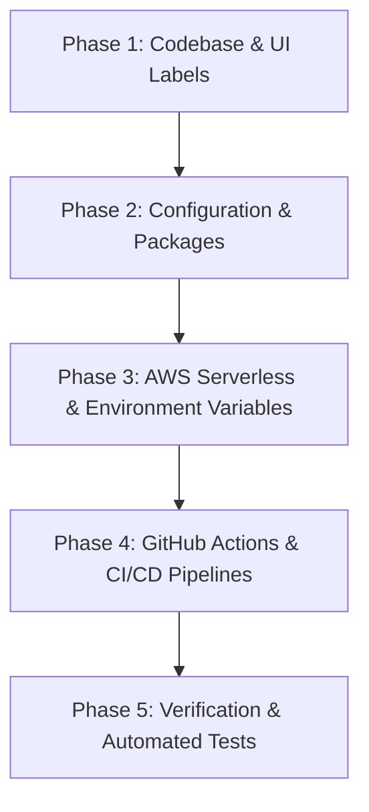

# 🔄 Technical Refactoring Plan: Project Renaming (`librarian` → `shelfd`)

> **Objective**: Migrate the codebase, documentation, AWS serverless infrastructure, environment configurations, and deployment pipelines from the legacy working title `librarian` to the official product name **Shelfd**.

---

## 🎯 Executive Summary & Scope

This document outlines the step-by-step technical refactoring plan required to update all layer names, package identifiers, environment variables, database table prefixes, and user-facing UI labels across the workspace.

---

## 📋 Refactoring Phases & Tasks

---

### Phase 1: Frontend App UI & Metadata (`app/`)
- [ ] **Expo Config (`app/app.json`)**: Update `name` to `"Shelfd"`, `slug` to `"shelfd-app"`, and scheme to `shelfd`.
- [ ] **Web SPA Title (`app/app/+html.tsx` / `app/index.html`)**: Update `<title>` tag to `Shelfd — Your Intelligent Personal Library`.
- [ ] **App Header UI & Branding**: Update visible app titles in navigation headers, drawer screens, and login branding.
- [ ] **Package Names (`app/package.json`)**: Rename package from `"librarian-app"` to `"shelfd-app"`.

---

### Phase 2: Backend Microservices & Lambda Handlers (`backend/`)
- [ ] **Package Name (`backend/package.json`)**: Rename package from `"librarian-backend"` to `"shelfd-backend"`.
- [ ] **DynamoDB Table Environment Fallbacks (`backend/src/services/dynamoService.ts` & `series.ts`)**:
  - `USERS_TABLE_NAME`: `shelfd-users`
  - `BOOKS_TABLE_NAME`: `shelfd-books`
  - `USER_LIBRARY_TABLE_NAME`: `shelfd-user-library`
  - `SERIES_TABLE_NAME`: `shelfd-series`
  - `USER_SERIES_STATUS_TABLE_NAME`: `shelfd-user-series-status`
  - *(Note: Multi-account strategy handles environment separation; environment prefixes like `-dev-` are omitted)*
- [ ] **AWS Secrets Manager Keys (`backend/src/services/geminiService.ts`)**:
  - Update fallback secret key from `librarian/gemini-api-key` to `shelfd/gemini-api-key`.
- [ ] **AWS S3 Bucket Environment Fallback (`backend/src/handlers/bookshelfAiHandler.ts`)**:
  - Update `BOOKSHELF_BUCKET_NAME` default from `librarian-bookshelf-uploads` to `shelfd-bookshelf-uploads`.

---

### Phase 3: Infrastructure as Code & AWS Resources
- [ ] **SAM / Serverless Template (`template.yaml` or AWS SAM configuration)**: Update Stack Name to `shelfd-backend-stack`.
- [ ] **AWS CloudFront & S3 SPA Hosting Bucket**: Update bucket naming and SPA distribution tags to `shelfd-web-spa`.
- [ ] **Cognito User Pool Identifier**: Update Cognito User Pool & App Client names to `shelfd-user-pool`.

---

### Phase 4: CI/CD Workflows & Repository Infrastructure
- [ ] **GitHub Actions (`.github/workflows/*.yml`)**:
  - Update build step names and environment variables to reference `shelfd`.
  - Update S3 sync and CloudFront distribution invalidation step names.
- [ ] **Docusaurus Site Config (`docs-site/docusaurus.config.js`)**:
  - Update `title` to `"Shelfd Documentation"`, `tagline`, and URL repository paths.

---

### Phase 5: Automated Testing & Verification
- [ ] **Backend Unit Tests**: Verify all backend tests pass (`cd backend && npm test`).
- [ ] **Backend TypeScript Build**: Verify SAM / tsc build completes (`cd backend && npm run build`).
- [ ] **Frontend Typecheck**: Verify TypeScript compilation (`cd app && npm run typecheck`).
- [ ] **Frontend Unit Tests**: Verify app tests pass (`cd app && npm test`).

---

## 🛡️ Execution Strategy & Rollout Plan

To ensure zero downtime and prevent broken environment pointers during the migration:
1. **Backward-Compatible AWS Environment Overrides**: Keep environment variable overrides supported while updating defaults to `shelfd-*`.
2. **Atomic Git Commit**: Perform phase edits in structured commits to allow quick rollback if needed.
3. **CI/CD Build Pipeline Verification**: Execute full local build & test matrices prior to pushing changes to `main`.
