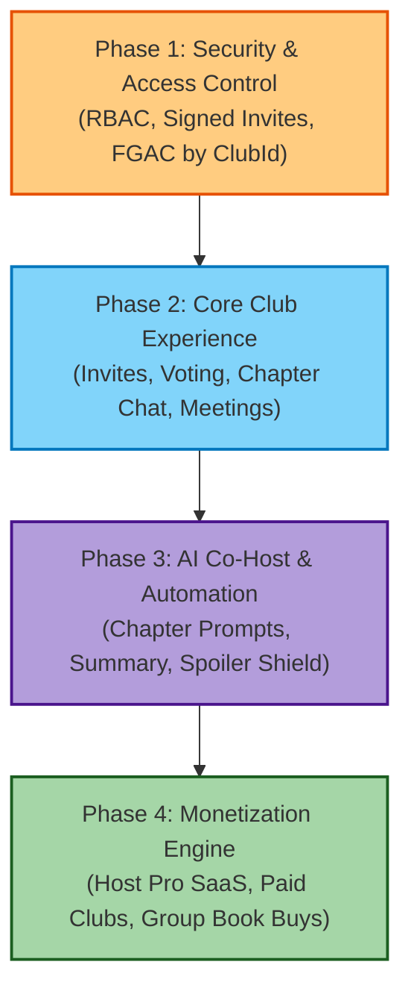
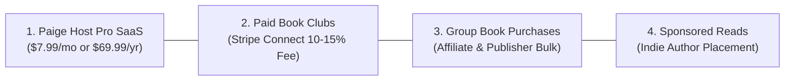

# Product Roadmap: Paige Book Clubs 📖👥

**Paige Book Clubs** expands the Paige ecosystem from individual library tracking to community-driven reading. It empowers organizers, local reading groups, content creators, and authors to set up, curate, invite, schedule, communicate, and monetize book clubs seamlessly.

---

## 🔒 Phase 1: Security & Foundation (Highest Priority)

Before opening multi-user communication channels, establish strict authorization boundaries and data privacy:

* **Role-Based Access Control (RBAC)**:
  * Roles: `Host` (Owner), `Co-Host` (Moderator), `Member`, `Guest`.
  * Scoped permissions for club settings, book selection, member removal, and discussion moderation.
* **Secure Tokenized Invites & Privacy Controls**:
  * Public vs. Private vs. Unlisted club visibility.
  * Time-limited, single-use, or max-redemption signed JWT invite links to prevent invite link spam/abuse.
* **Data Isolation & WebSockets Security**:
  * DynamoDB Fine-Grained Access Control (FGAC) enforcing `clubId` and user authorization for all reads/writes.
  * WSS (WebSocket) authentication authorizer checking JWT tokens on every real-time chat connection.
* **Content Moderation & Input Sanitization**:
  * XSS and injection prevention on all chat messages and club description fields.
  * Rate-limiting on chat message sending and member invitations.

---

## 🚀 Phase 2: Functional Core & Member Experience

Build the end-to-end journey from group creation to finishing a book together.

### 1. Member Invites & Onboarding
* **Multi-Channel Invites**: Dynamic link generation, custom QR code export (for in-person local flyers/bookmarks), and email/SMS direct invites.
* **Member Management Dashboard**: Attendance tracking, active vs. inactive member status, and pending invite approvals.

### 2. Democratic Book Selection & Pacing
* **Poll & Nomination System**: Hosts or members submit candidate titles from Paige's global catalog. Automated voting deadlines with single-choice or ranked-choice voting.
* **Smart Reading Schedule Planner**: Break down selected books by chapter or page counts across weeks (e.g., "Chapters 1–5 by Oct 12th").

### 3. Member Communication & Meetings
* **Chapter-Gated Discussion Channels**: Structured chat threads unlocked per schedule milestone to prevent accidental spoilers.
* **Live Meeting Planner**: Calendar sync (`.ics` download, Google/Apple Calendar integration) and embedded video call link sharing (Zoom, Google Meet, Discord).

---

## 🤖 Phase 3: AI & Advanced Enhancements ("Paige AI Co-Host")

Leverage LLM intelligence to lighten the host's administrative burden and elevate discussions:

* **Automated Chapter Discussion Prompts**: AI generates 3–5 thought-provoking discussion questions tailored to the specific chapters assigned for the week.
* **Spoiler-Shield Guard**: Natural language classifier automatically flags and hides potential plot spoilers in general chat threads until revealed by the reader.
* **Meeting Recaps & Key Takeaways**: AI synthesizes chat highlights and meeting notes into a digestible summary for members who missed a session.

---

## 💰 Phase 4: Comprehensive Monetization Framework

Transforming book clubs into a sustainable revenue generator for Paige and club organizers:

### 1. **"Paige Host Pro" SaaS Subscription**
* **Target Audience**: Bookstagrammers, TikTok creators, community leaders, independent bookstores running multiple reading groups.
* **Price**: $7.99 / month or $69.99 / year.
* **Features**:
  * Unlimited active book clubs and unlimited members (Free tier capped at 1 club, max 12 members).
  * Access to "Paige AI Co-Host" discussion prompt generator.
  * Custom branding (logos, banners, custom invite subdomains).
  * Exportable member analytics and reading pace insights.

### 2. **Paid / Ticketed Book Clubs (Host-Led Subscriptions)**
* **Target Audience**: Expert-led reading groups (e.g., philosophical deep dives, masterclasses, celebrity/author book clubs).
* **Model**: Hosts set a monthly subscription (e.g., $15/month per member) or one-time ticket price per book read.
* **Platform Revenue Split**: Integrated via **Stripe Connect**. Paige takes a **10% to 15% platform fee** on all membership dues processed through the app.

### 3. **Group Book Purchase & Affiliate Commerce**
* **One-Click Group Cart**: When a book is selected, provide one-click purchase options with member group discounts:
  * **Affiliate Revenue**: Amazon Associates, Bookshop.org affiliate commission (5–10% per book sale).
  * **Bulk Print Partner Integration**: Partner with distributors (e.g., Ingram) to offer discounted physical bundles shipped directly to club members.

### 4. **Sponsored Reads & Publisher Promotions**
* **Indie Author / Publisher Discovery Marketplace**: Publishers and self-published authors pay Paige to list their book in a "Featured Book Club Candidates" showcase.
* **Pay-per-Club Pick Model**: Authors sponsor sample chapters or offer free ebook downloads to clubs, with Paige taking a placement fee.
